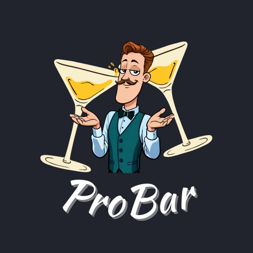

<!-- Logo -->

	

---

Bem-vindo ao repositório oficial do **ProBar** - um projeto acadêmico que desenvolve uma plataforma web para intermediação de serviços entre clientes e bartenders.

## Sumário

- [Descrição](#descrição)
- [Objetivos](#objetivos)
- [Perfis de usuário](#perfis-de-usu%C3%A1rio)
- [Tecnologias](#tecnologias)
- [Organização do repositório](#organiza%C3%A7%C3%A3o-do-reposit%C3%B3rio)
- [Licença](#licença)

## Descrição

A plataforma permite que clientes encontrem profissionais, visualizem perfis e solicitem serviços, e que bartenders divulguem seus serviços, gerenciem disponibilidade e acompanhem solicitações.

Objetivos
---------

- Construir uma aplicação web funcional, segura e acessível.
- Aplicar boas práticas de engenharia de software e metodologias ágeis.
- Entregar um MVP pronto para testes e validação acadêmica.

Perfis de usuário
-----------------

- Cliente: busca e contrata bartenders para eventos.
- Bartender: gerencia perfil, serviços e solicitações recebidas.

Tecnologias
-----------

- Frontend: Next.js / React
- Backend: Django / Django REST Framework
- Banco de Dados: PostgreSQL
- Prototipação: Figma
- Versionamento: Git / GitHub

Organização do repositório
--------------------------

O repositório principal do projeto é `probar-repo`, que contém o front-end e o back-end no mesmo repositório.

Licença

Este projeto é de propriedade exclusiva da **ProBar**. 
Todos os direitos reservados. Para mais detalhes, consulte o arquivo [LICENSE](../LICENSE).

